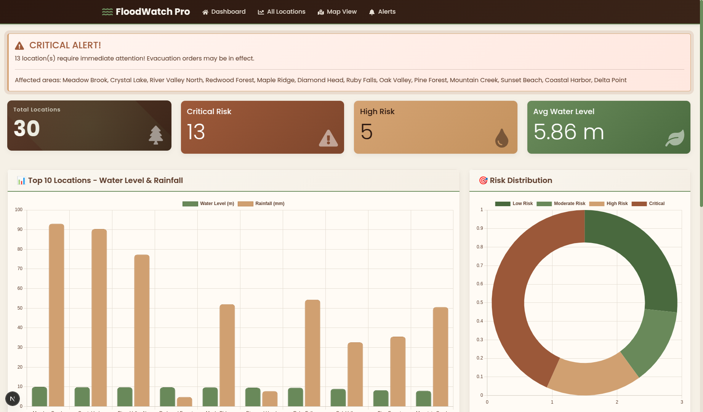
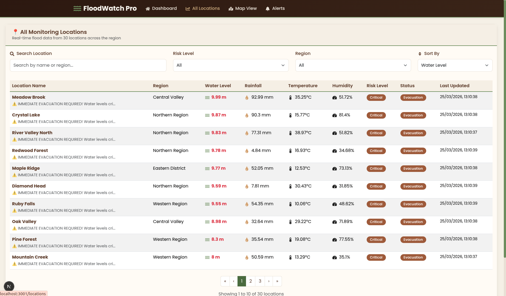
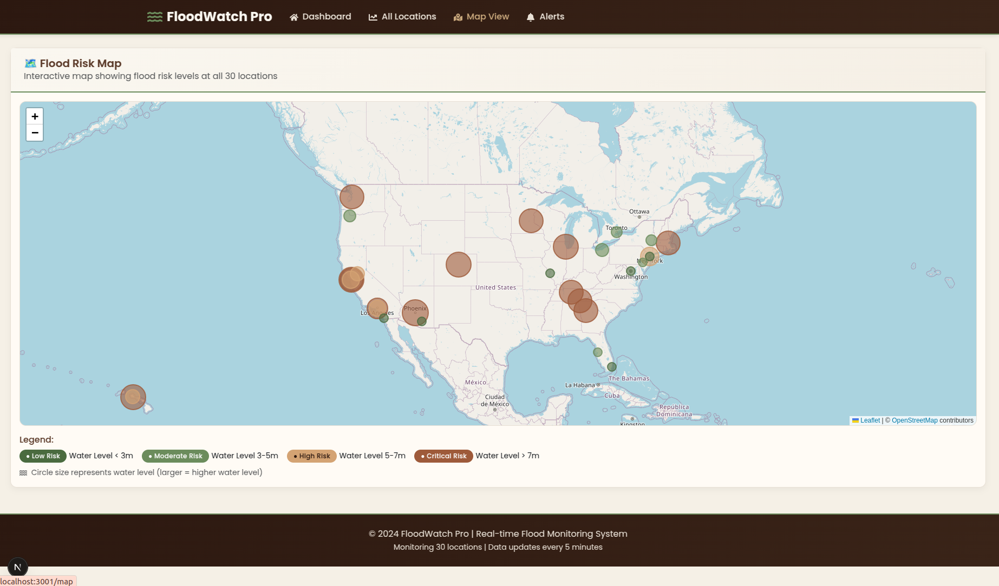
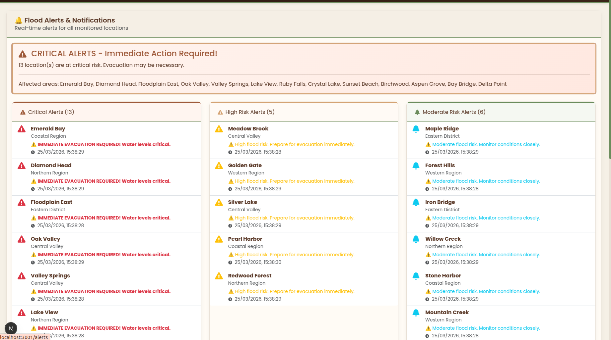
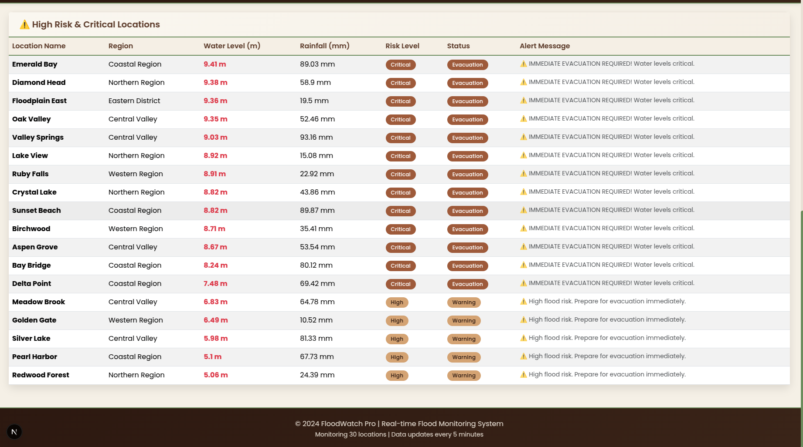
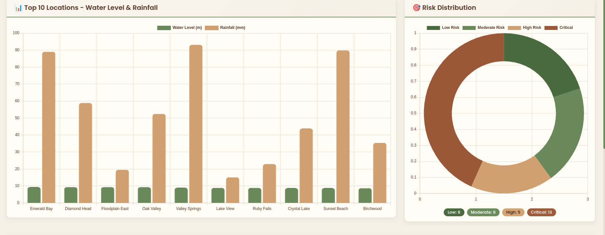

# 🌊 FloodWatch Pro - Real-time Flood Monitoring System


A comprehensive flood monitoring system that tracks water levels, rainfall, and risk levels across 30 locations in real-time. Built with the MERN stack (MongoDB, Express.js, React/Next.js, Node.js).

## 📸 Screenshots

### Dashboard Overview

*Real-time dashboard showing key metrics, charts, and high-risk locations*

### All Locations View

*Complete list of 30 locations with search, filter, and sort functionality*

### Interactive Map

*Geographic visualization with color-coded risk level markers*

### Alert System

*Categorized alerts for different risk levels*

### Critical Alerts

*Immediate action alerts for critical flood situations*

### Data Visualization

*Interactive charts showing water levels and rainfall trends*


## 🚀 Features

- **Real-time Monitoring**: Live data updates every 30 seconds
- **Interactive Dashboard**: Visualize flood data with charts and statistics
- **Location Management**: View all 30 locations with search, filter, and sort capabilities
- **Interactive Map**: Geographic visualization of flood risk levels with color-coded markers
- **Alert System**: Categorized alerts for different risk levels (Critical, High, Moderate)
- **Responsive Design**: Works seamlessly on desktop, tablet, and mobile devices
- **Professional UI**: Earthy color scheme with brown and green tones

## 📊 Dashboard Features

### Statistics Cards
- **Total Locations**: 30 monitored sites
- **Critical Risk**: Locations requiring immediate evacuation
- **High Risk**: Areas with high flood probability
- **Average Water Level**: Mean water level across all locations

### Charts
- **Water Level vs Rainfall**: Bar chart comparison for top 10 locations
- **Risk Distribution**: Doughnut chart showing risk level breakdown

### High-Risk Table
- List of locations with water levels > 5m
- Real-time status updates
- Alert messages for each location

## 🗺️ Map Features

- **Interactive Leaflet Map**: 30 location markers
- **Color-coded Markers**:
  - 🟢 Green: Low risk (water level < 3m)
  - 🔵 Blue: Moderate risk (water level 3-5m)
  - 🟡 Yellow: High risk (water level 5-7m)
  - 🔴 Red: Critical risk (water level > 7m)
- **Dynamic Circle Size**: Larger circles indicate higher water levels
- **Popup Information**: Complete location details on click

## 🔔 Alert System

### Alert Categories
1. **Critical Alerts (🔴)**
   - Water level > 7m
   - Immediate evacuation required
   - Red badge with pulse animation

2. **High Risk Alerts (🟡)**
   - Water level 5-7m
   - Prepare for evacuation
   - Orange warning badge

3. **Moderate Alerts (🔵)**
   - Water level 3-5m
   - Monitor conditions closely
   - Blue info badge

4. **Normal Status (🟢)**
   - Water level < 3m
   - Regular monitoring
   - Green success badge

## 🛠️ Tech Stack

### Backend
- **Node.js** - JavaScript runtime
- **Express.js** - Web framework
- **MongoDB** - NoSQL database
- **Mongoose** - ODM for MongoDB
- **CORS** - Cross-origin resource sharing

### Frontend
- **Next.js 14** - React framework with App Router
- **React Bootstrap** - UI components
- **Chart.js** - Data visualization
- **Leaflet** - Interactive maps
- **Axios** - HTTP client
- **React Icons** - Icon library


## 🚀 Getting Started

### Prerequisites

- Node.js (v18 or higher)
- MongoDB (local installation or MongoDB Atlas account)
- npm or yarn package manager

### Installation

1. **Clone the repository**
```bash
git clone https://github.com/VarshaVasudevan/flood-mern
cd flood-monitoring-system

cd server
npm install
npm run dev

cd client
npm install
npm run dev